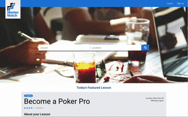
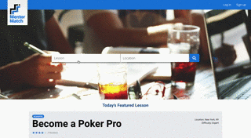
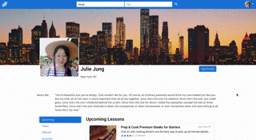
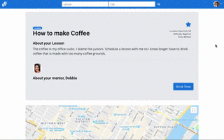

# Mentor Match

Welcome to Mentor Match! A web application that allows users to connect with other users offering mentorship/lessons in regards to a specific topic.


## Built With

---

- **React** - Used to render the client
- **React Router** - Used for front end routes
- **Apollo Client** - GraphQl client for iuse with React
- **GraphQL** - API queries
- **Sequelize** - ORM
- **PostgreSQL** - Database
- **Node.JS** - Server
- **Axios** - HTTP request with Redis search
- **Redis Search** - Search functionality
- **Geo suggest** - Location identificaiton for search functionality
- **Firebase** - Authentication middleware
- **Stripe** - Payment functionality (Only sending dummy payments)

## Installing Dependencies

```
npm install
```

## Team

- Product Owner: Alexander Charles
- Scrum Master: Julie Jung
- Developers: Alan Chang, Arjun Logeswaran

## Screenshots




Once the user signs in, the recommendations changes according to the user's city of residence.




MentorMatch can conduct O(1) search with the power of Redisearch and its inverted indexing methods.




