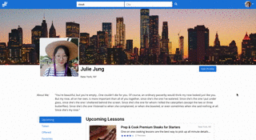

# Mentor Match

Welcome to Mentor Match! A web application that allows users to connect with other users offering mentorship/lessons in regards to a specific topic. Visit us at [mentormatch.host](http://mentormatch.host)


## Table of Contents

1. [Built With](#built-with)
1. [Getting Started](#getting-started)
   1. [Installing Dependencies](#installing-dependencies)
   1. [Development Environment](#development-environment)
1. [Authors](#authors)
1. [Screenshots](#screenshots)
1. [Styling](#styling)
1. [Contributing](#contributing)
1. [Licensing](#licensing)

## Built With

- **React** - Used to render the client
- **React Router** - Used for front end routes
- **Apollo Client** - GraphQl client for iuse with React
- **GraphQL** - API queries
- **Sequelize** - ORM
- **PostgreSQL** - Database
- **Node.JS** - Server
- **Axios** - HTTP request with Redis search
- **Redis Search** - Search functionality
- **Geo suggest** - Location identificaiton for search functionality
- **Firebase** - Authentication middleware
- **Stripe** - Payment functionality (Only sending dummy payments)

## Getting Started

### Installing Dependencies

You must install Docker to be able to run this application. Please reference [Docker](https://www.docker.com/) on the installation procedure.

### Development Environment

To start up the multi container application, from within the root directory:

```sh
docker-compose up
```

To check the containers are running:

```sh
docker-compose ps
```

## Team

- Product Owner: Alexander Charles
- Scrum Master: Julie Jung
- Developers: Alan Chang, Arjun Logeswaran

## Screenshots


Once the user signs in, the recommendations changes according to the user's city of residence.


MentorMatch can conduct O(1) search with the power of Redisearch and its inverted indexing methods.


Users can navigate through their profile page for previously booked lessons, upcoming lessons, and lessons that they offer.

Every lesson has a lesson details page where the user can view information on the lesson, the mentor, and the reviews by other users who have taken the lesson in the past.

## Styling

MentorMatch uses the [Airbnb JavaScript Style Guide](https://github.com/airbnb/javascript/).

## Contributing

See [CONTRIBUTING.md](CONTRIBUTING.md) for contribution guidelines.

## Licensing

MentorMatch uses the [MIT License](LICENSE.MD)
